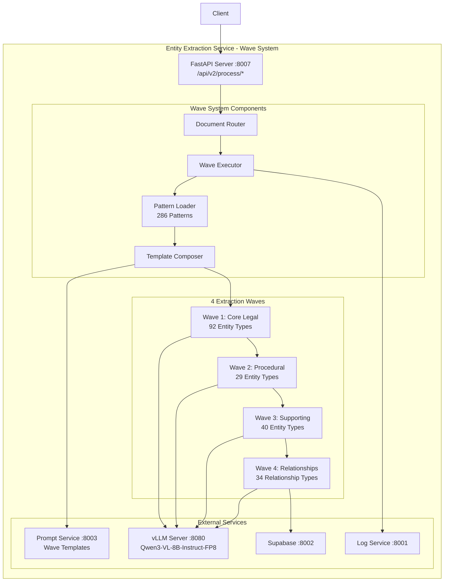
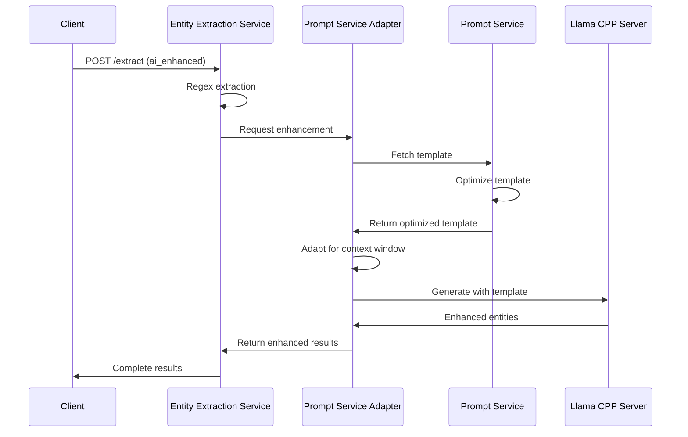

# Entity Extraction Service

## 🎯 Overview

The Entity Extraction Service is a high-performance legal entity extraction system that combines traditional regex patterns with AI-powered enhancement to extract and validate 295+ types of legal entities from documents. Built with a hybrid REGEX + vLLM architecture, it achieves breakthrough 176ms performance while maintaining exceptional accuracy and Bluebook 22nd Edition compliance.

**Version**: 2.0.1
**Port**: 8007
**Status**: Production Ready with Configuration Migration

### ⚡ Key Features

- **Wave System Architecture**: Intelligent 4-wave extraction strategy with document routing
- **195+ Entity Types**: Comprehensive legal entity coverage across 4 specialized waves
- **34 Relationship Types**: GraphRAG-ready relationship extraction in Wave 4
- **Intelligent Document Routing** - Automatic strategy selection based on document size and complexity
- **Unified Pattern API** - Single endpoint for all pattern discovery needs (entities & relationships)
- **Comprehensive Relationship Extraction** - 34 relationship types across 6 categories
- **GraphRAG Integration** - Wave 4 relationship extraction for knowledge graphs
- **Pattern Caching** - High-performance pattern caching with statistics
- **Health Monitoring** - Multi-level health checks with dependency tracking
- **PatternLoader Integration**: 286 patterns providing few-shot learning examples
- **vLLM Integration**: Qwen3-VL-8B-Instruct-FP8 with 160K context on GPU
- **100MB Request Limit**: Handles large documents (increased from 10MB)
- **50 CPU Cores**: Massively parallel processing capability
- **16 Worker Processes**: Optimized for concurrent extractions
- **Bluebook 22nd Edition**: Full citation compliance
- **26 Active Endpoints**: Streamlined Wave System-only architecture (+ 2 deprecated)

### 🚀 Recent Updates (2025)

- **Request Size Increase**: Now supports 100MB requests (10x increase)
- **CPU Allocation**: 50 CPU cores allocated for massive parallelization
- **Worker Optimization**: 16 Uvicorn workers for concurrent processing
- **vLLM Backend**: GPU-accelerated AI enhancement with Granite 3.3 2B
- **PDF Handling**: Fixed binary PDF issues - requires text extraction first
- **Memory Allocation**: 40GB RAM with optimized garbage collection
- **Timeout Configuration**: 1200 second timeouts for large documents

## 🏗️ Architecture



### Component Descriptions

- **Document Router**: Intelligently selects extraction strategy based on document size and complexity
- **Wave Executor**: Orchestrates 4-wave progressive extraction with dependency management
- **Pattern Loader**: Provides 286 pattern examples from 53 YAML files for few-shot learning
- **Template Composer**: Injects pattern examples into wave templates at runtime
- **Wave 1-4 Extractors**: Specialized extractors for progressive entity discovery
- **External Services**: Integration with Prompt Service (wave templates), vLLM (inference), logging, and database

## 🚀 Installation

### Prerequisites

- Python 3.10+
- 8GB+ RAM (16GB recommended for optimal performance)
- GPU with 8GB+ VRAM (optional but recommended for vLLM)
- Required Running Services:
  - **Log Service** (port 8001) - Centralized logging
  - **Prompt Service** (port 8003) - AI template management
  - **Supabase Service** (port 8002) - Database operations
  - **vLLM or Llama CPP server** (port 8080) - LLM inference

### Quick Start

⚠️ **CRITICAL: Virtual Environment Already Exists**

The virtual environment (`venv/`) is **ALREADY CREATED** in this service directory. **DO NOT** create a new venv - just activate the existing one!

```bash
# Navigate to service directory
cd /srv/luris/be/entity-extraction-service

# ✅ CORRECT - Activate existing venv
source venv/bin/activate

# ❌ WRONG - Never do this (venv already exists!)
# python3 -m venv venv  # DON'T DO THIS!

# Install dependencies (only if requirements changed)
pip install -r requirements.txt

# Download spaCy language model (only if not already installed)
python -m spacy download en_core_web_sm

# Verify venv activation
which python  # Should show: /srv/luris/be/entity-extraction-service/venv/bin/python

# Run the service
python run.py
```

**Verification Commands:**
```bash
# Confirm you're using the correct Python
which python
# Expected: /srv/luris/be/entity-extraction-service/venv/bin/python

# Check installed packages
pip list | grep fastapi

# Verify service can import modules
python -c "from src.api.main import app; print('✅ Imports working')"
```

### Quick API Reference

**Primary Extraction:**
```bash
# Extract entities using Wave System
curl -X POST http://10.10.0.87:8007/api/v2/process/extract \
  -H "Content-Type: application/json" \
  -d '{"document_text":"28 U.S.C. § 1331 provides federal question jurisdiction."}'
```

**Document Routing:**
```bash
# Get optimal processing strategy
curl -X POST http://10.10.0.87:8007/api/v1/route \
  -H "Content-Type: application/json" \
  -d '{"document_text":"Legal document text..."}'

# View available strategies
curl http://10.10.0.87:8007/api/v1/strategies
```

**Pattern Discovery:**
```bash
# Get all patterns (entities and relationships)
curl "http://10.10.0.87:8007/api/v1/patterns?type=all&format=detailed"

# Filter patterns by entity type
curl "http://10.10.0.87:8007/api/v1/patterns?type=entities&entity_type=COURT"
```

**Health Checks:**
```bash
# Basic health
curl http://10.10.0.87:8007/api/v1/health/ping

# Comprehensive health
curl http://10.10.0.87:8007/api/v1/health/detailed
```

### Docker Installation

```dockerfile
FROM python:3.10-slim

WORKDIR /app

# Install system dependencies
RUN apt-get update && apt-get install -y \
    build-essential \
    && rm -rf /var/lib/apt/lists/*

COPY requirements.txt .
RUN pip install --no-cache-dir -r requirements.txt
RUN python -m spacy download en_core_web_sm

COPY . .

EXPOSE 8007

CMD ["python", "run.py"]
```

```bash
# Build and run with Docker
docker build -t entity-extraction-service .
docker run -d \
  --name entity-extraction \
  -p 8007:8007 \
  -e PROMPT_SERVICE_URL=http://prompt-service:8003 \
  -e VLLM_SERVER_URL=http://vllm:8080 \
  entity-extraction-service
```

### systemd Service Installation

```bash
# Install as systemd service
sudo ./install_systemd.sh

# Start the service
sudo systemctl start luris-entity-extraction

# Enable on boot
sudo systemctl enable luris-entity-extraction

# Check status
sudo systemctl status luris-entity-extraction

# View logs
sudo journalctl -u luris-entity-extraction -f
```

## ⚙️ Configuration

**⚠️ BREAKING CHANGE (v2.0.1)**: Configuration migration from YAML to .env completed.

The service uses environment variables for all configuration, following the 12-Factor App pattern for production deployments.

### Configuration Files
- **Primary**: `.env` (161 environment variables - REQUIRED)
- **Example Template**: `.env.example` (copy and customize for your deployment)
- **Archive**: `config/archive/settings.yaml.deprecated` (YAML configuration deprecated as of v2.0.1)

### Configuration Migration (v2.0.1)

If upgrading from v2.0.0:
1. **Archive old YAML**: `mv config/settings.yaml config/archive/settings.yaml.deprecated`
2. **Copy template**: `cp .env.example .env`
3. **Customize .env**: Edit with your settings (see required variables below)
4. **Restart service**: `sudo systemctl restart luris-entity-extraction`
5. **See detailed migration guide**: `docs/MIGRATION_GUIDE_v2.0.1.md`

### Key Configuration Sections

Configuration is organized into 14 sections (161 total variables):

1. **Service Configuration** (10 vars) - Port, host, debug mode, security settings
2. **Logging Configuration** (14 vars) - Structured logging, rotation, retention
3. **Database - Supabase** (6 vars) - Connection details and storage settings
4. **vLLM Direct Integration** (7 vars) - AI service configuration
5. **Core Extraction Settings** (9 vars) - Modes, confidence thresholds, patterns
6. **Chunking Configuration** (9 vars) - Internal chunking settings
7. **Service URLs** (7 vars) - Microservice endpoints
8. **Performance & Resource Management** (6 vars) - Memory, caching, threading
9. **Security** (3 vars) - JWT, API keys
10. **vLLM Advanced Configuration** (30 vars) - GPU, model optimization
11. **Pattern System Configuration** (10 vars) - Pattern loading and caching
12. **Regex Engine Configuration** (5 vars) - Regex compilation and execution
13. **Performance & Model Tuning** (20 vars) - Multi-pass, deduplication, quality
14. **Health Check Configuration** (11 vars) - Monitoring and alerting
15. **Performance Monitoring** (10 vars) - Metrics collection and analysis

### Environment Variables

All configuration is managed through environment variables in `.env`:

```bash
# Copy template and customize
cp .env.example .env
nano .env  # Edit with your settings
```

**Required Variables** (must be set before first run):
- `SUPABASE_URL`, `SUPABASE_KEY`, `SUPABASE_API_KEY`, `SUPABASE_SERVICE_KEY`
- `SERVICE_URL`, `AI_EXTRACTION_VLLM_URL`, all service URLs in section 6
- `JWT_SECRET` (generate a secure random string)

### Example Configuration Snippet

```bash
# Service Configuration
PORT=8007
HOST=0.0.0.0
ENVIRONMENT=production
SERVICE_NAME=entity-extraction-service
DEBUG_MODE=false
LOG_LEVEL=INFO

# Database - Supabase
SUPABASE_URL=https://your-project.supabase.co
SUPABASE_KEY=your-anon-key
SUPABASE_SERVICE_KEY=your-service-role-key

# vLLM Direct Integration
AI_EXTRACTION_ENABLED=true
AI_EXTRACTION_USE_VLLM=true
AI_EXTRACTION_VLLM_URL=http://10.10.0.87:8080/v1
AI_EXTRACTION_MODEL_NAME=qwen-instruct-160k

# Core Extraction Settings
EXTRACTION_DEFAULT_MODE=ai_enhanced
EXTRACTION_CONFIDENCE_THRESHOLD=0.7
NO_ENTITY_LIMIT=true

# Performance
MAX_CONCURRENT_EXTRACTIONS=10
CACHE_ENABLED=true
METRICS_ENABLED=true
```

**For complete documentation of all 161 variables, see `.env.example`.**

## 📚 Complete Entity Type Reference

The service supports **275+ legal entity types** organized into **31 main categories**. Each entity type has specific extraction patterns, validation rules, and AI enhancement capabilities.

### 🏛️ Courts & Judicial Entities (8 types)

<details>
<summary><b>COURT</b> - Court names and references</summary>

**Pattern Examples:**
```regex
(Supreme Court of the United States|U\.S\. Supreme Court)
(United States (?:District|Bankruptcy) Court for the [A-Z][a-z]+ District of [A-Z][a-z]+)
([A-Z][a-z]+ (?:Superior|Circuit|District|Municipal) Court)
```

**Extracted Attributes:**
- `court_name`: Full official name
- `court_level`: supreme, appellate, district, state, municipal
- `jurisdiction`: federal, state, local
- `district/circuit`: Specific district or circuit number

**Examples:**
- "Supreme Court of the United States"
- "United States District Court for the Southern District of New York"
- "California Court of Appeal, Second Appellate District"
- "Los Angeles County Superior Court"

**AI Enhancements:**
- Canonical name resolution
- Jurisdiction identification
- Court hierarchy mapping
</details>

<details>
<summary><b>JUDGE</b> - Judge names and titles</summary>

**Pattern Examples:**
```regex
((?:Chief )?Justice [A-Z][a-z]+(?: [A-Z]\.)? [A-Z][a-z]+)
((?:The Honorable |Hon\. )?(?:Judge |Magistrate )?[A-Z][a-z]+ [A-Z][a-z]+)
([A-Z][a-z]+ [A-Z][a-z]+, (?:U\.S\.D\.J\.|U\.S\.M\.J\.|J\.|M\.J\.))
```

**Extracted Attributes:**
- `judge_name`: Full name with middle initial if present
- `title`: Chief Justice, Associate Justice, Judge, Magistrate
- `court`: Associated court name
- `appointment_type`: federal, state, elected, appointed
- `honorific`: "The Honorable" or "Hon."

**Examples:**
- "Chief Justice John Roberts"
- "Judge Sarah Thompson"
- "The Honorable Michael Chen, U.S.D.J."
- "Magistrate Judge Lisa Park"
- "Justice Ruth Bader Ginsburg"

**AI Enhancements:**
- Title standardization
- Court association
- Historical judge validation
</details>

<details>
<summary><b>MAGISTRATE</b> - Magistrate judges</summary>

**Pattern Examples:**
```regex
(Magistrate Judge [A-Z][a-z]+ [A-Z][a-z]+)
(U\.S\. Magistrate Judge [A-Z][a-z]+ [A-Z][a-z]+)
```

**Examples:**
- "Magistrate Judge Lisa Park"
- "U.S. Magistrate Judge David Wilson"
- "Chief Magistrate Judge Jennifer Brown"
</details>

<details>
<summary><b>ARBITRATOR</b> - Arbitrators and panels</summary>

**Examples:**
- "Arbitrator Jennifer Smith, AAA Panel"
- "JAMS Arbitrator Robert Brown"
- "ICC Arbitration Panel"
</details>

<details>
<summary><b>MEDIATOR</b> - Mediators and conciliators</summary>

**Examples:**
- "Mediator Thomas Anderson, Esq."
- "Court-appointed mediator Jane Doe"
- "FINRA Mediator Panel"
</details>

<details>
<summary><b>SPECIAL_MASTER</b> - Special masters</summary>

**Examples:**
- "Special Master appointed pursuant to Rule 53"
- "Discovery Special Master John Smith"
- "Technical Special Master for patent claims"
</details>

<details>
<summary><b>COURT_CLERK</b> - Court clerks</summary>

**Examples:**
- "Clerk of the Court"
- "Deputy Clerk Martinez"
- "Court Clerk Susan Johnson"
</details>

<details>
<summary><b>COURT_REPORTER</b> - Court reporters</summary>

**Examples:**
- "Court Reporter: Jane Smith, CSR No. 12345"
- "Official Reporter Sarah Johnson"
- "Certified Court Reporter Michael Brown"
</details>

### ⚖️ Parties & Representatives (11 types)

<details>
<summary><b>PLAINTIFF</b> - Plaintiffs and petitioners</summary>

**Pattern Examples:**
```regex
(Plaintiff(?:s)?(?:-Appellant(?:s)?|-Appellee(?:s)?)? [A-Z][a-z]+(?:,? [A-Z][a-z]+)*)
([A-Z][a-z]+ [A-Z][a-z]+(?:,? (?:individually and )?on behalf of all others similarly situated))
```

**Extracted Attributes:**
- `party_name`: Full name or entity name
- `party_type`: individual, corporation, class
- `representation`: pro se, represented
- `class_action`: boolean for class representative
- `appellate_status`: appellant, appellee if applicable

**Examples:**
- "Plaintiff John Doe"
- "Plaintiffs ABC Corporation and XYZ Inc."
- "Jane Smith, individually and on behalf of all others similarly situated"
- "Plaintiff-Appellant Microsoft Corporation"

**AI Enhancements:**
- Entity type classification
- Class action detection
- Corporate entity resolution
</details>

<details>
<summary><b>DEFENDANT</b> - Defendants and respondents</summary>

**Pattern Examples:**
```regex
(Defendant(?:s)?(?:-Appellant(?:s)?|-Appellee(?:s)?)? [A-Z][a-z]+(?:,? [A-Z][a-z]+)*)
([A-Z][a-z]+ [A-Z][a-z]+, a [A-Z][a-z]+ corporation, Defendant)
```

**Examples:**
- "Defendant Acme Corporation"
- "Defendants John Doe and Jane Roe"
- "XYZ Company, a Delaware corporation, Defendant"
- "Defendant-Appellee State of California"
</details>

<details>
<summary><b>APPELLANT</b> - Appellants in appeals</summary>

**Examples:**
- "Appellant-Plaintiff John Smith"
- "Cross-Appellant ABC Corp."
- "Appellant United States of America"
</details>

<details>
<summary><b>APPELLEE</b> - Appellees in appeals</summary>

**Examples:**
- "Appellee-Defendant State of California"
- "Respondent-Appellee Jane Doe"
- "Cross-Appellee Insurance Company"
</details>

<details>
<summary><b>PETITIONER</b> - Petitioners in writs</summary>

**Examples:**
- "Petitioner seeks writ of mandamus"
- "Habeas Petitioner John Doe"
- "Petitioner State of Texas"
</details>

<details>
<summary><b>RESPONDENT</b> - Respondents</summary>

**Examples:**
- "Respondent Board of Education"
- "Government Respondent"
- "Respondent Commissioner of Internal Revenue"
</details>

<details>
<summary><b>INTERVENOR</b> - Intervening parties</summary>

**Examples:**
- "Proposed Intervenor Environmental Defense Fund"
- "Intervenor-Defendant United States"
- "Intervenor American Civil Liberties Union"
</details>

<details>
<summary><b>AMICUS_CURIAE</b> - Amicus curiae</summary>

**Examples:**
- "Amicus Curiae American Civil Liberties Union"
- "Brief of Amici Curiae Law Professors"
- "Amicus Curiae Electronic Frontier Foundation"
</details>

<details>
<summary><b>THIRD_PARTY</b> - Third-party defendants</summary>

**Examples:**
- "Third-Party Defendant Insurance Company"
- "Third-Party Plaintiff XYZ Corp."
</details>

<details>
<summary><b>CLASS_REPRESENTATIVE</b> - Class representatives</summary>

**Examples:**
- "Class Representative Jane Doe"
- "Named Plaintiffs and Class Representatives"
- "Lead Plaintiff in securities class action"
</details>

### 👔 Legal Professionals (8 types)

<details>
<summary><b>ATTORNEY</b> - Attorneys and counsel</summary>

**Pattern Examples:**
```regex
([A-Z][a-z]+ [A-Z][a-z]+, Esq\.(?: \(Bar No\. \d+\))?)
(Attorney [A-Z][a-z]+ [A-Z][a-z]+(?:, admitted pro hac vice)?)
(Counsel for (?:Plaintiff|Defendant): [A-Z][a-z]+ (?:& |and )[A-Z][a-z]+)
```

**Extracted Attributes:**
- `attorney_name`: Full name
- `bar_number`: Bar admission number
- `firm`: Associated law firm
- `representation`: Party represented
- `admission_status`: regular, pro hac vice, local counsel
- `email`: Contact email if present
- `phone`: Contact phone if present

**Examples:**
- "John Smith, Esq. (Bar No. 123456)"
- "Attorney Sarah Johnson, admitted pro hac vice"
- "Counsel for Plaintiff: Davis & Associates"
- "Mary Wilson, Esq., Lead Counsel"

**AI Enhancements:**
- Bar number validation
- Firm association
- Multi-jurisdictional admission tracking
</details>

<details>
<summary><b>LAW_FIRM</b> - Law firms and legal organizations</summary>

**Pattern Examples:**
```regex
([A-Z][a-z]+(?:,? [A-Z][a-z]+)* (?:LLP|LLC|PC|PA|P\.C\.|P\.A\.))
([A-Z][a-z]+, [A-Z][a-z]+ (?:& |and )[A-Z][a-z]+(?:, (?:LLP|LLC))?)
```

**Extracted Attributes:**
- `firm_name`: Full firm name
- `firm_type`: LLP, LLC, PC, PA
- `office_location`: City and state
- `representing`: Client or party represented
- `attorneys`: Associated attorneys

**Examples:**
- "Jones, Smith & Associates LLP"
- "Baker McKenzie"
- "Skadden, Arps, Slate, Meagher & Flom LLP"
- "Wilson Sonsini Goodrich & Rosati PC"
</details>

<details>
<summary><b>PROSECUTOR</b> - Prosecutors</summary>

**Examples:**
- "Assistant United States Attorney John Doe"
- "District Attorney Jane Smith"
- "Special Prosecutor Robert Mueller"
- "State's Attorney Michael Johnson"
</details>

<details>
<summary><b>PUBLIC_DEFENDER</b> - Public defenders</summary>

**Examples:**
- "Federal Public Defender's Office"
- "Assistant Public Defender Sarah Wilson"
- "Chief Public Defender Thomas Brown"
</details>

<details>
<summary><b>LEGAL_AID</b> - Legal aid organizations</summary>

**Examples:**
- "Legal Aid Society of New York"
- "Pro Bono Counsel from Legal Services Corporation"
- "California Rural Legal Assistance"
</details>

<details>
<summary><b>PARALEGAL</b> - Paralegals and assistants</summary>

**Examples:**
- "Paralegal: Jennifer Brown"
- "Legal Assistant Mary Johnson"
- "Certified Paralegal Susan Davis"
</details>

<details>
<summary><b>EXPERT_WITNESS</b> - Expert witnesses</summary>

**Examples:**
- "Dr. Michael Chen, expert in forensic accounting"
- "Expert Witness Professor Jane Smith, Ph.D."
- "Forensic Expert John Anderson, M.D."
</details>

<details>
<summary><b>LAY_WITNESS</b> - Lay witnesses</summary>

**Examples:**
- "Witness John Doe testified"
- "Eyewitness Sarah Thompson"
- "Character Witness Robert Johnson"
</details>

### 🏛️ Government & Agencies (7 types)

<details>
<summary><b>FEDERAL_AGENCY</b> - Federal agencies</summary>

**Pattern Examples:**
```regex
(Securities and Exchange Commission|SEC)
(Federal Trade Commission|FTC)
(Environmental Protection Agency|EPA)
(Department of [A-Z][a-z]+(?:,? [A-Z][a-z]+)*)
```

**Examples:**
- "Securities and Exchange Commission"
- "Federal Trade Commission"
- "Department of Justice"
- "Environmental Protection Agency"
- "Internal Revenue Service"
- "Federal Communications Commission"
</details>

<details>
<summary><b>STATE_AGENCY</b> - State agencies</summary>

**Examples:**
- "California Department of Motor Vehicles"
- "Texas Railroad Commission"
- "New York State Department of Health"
- "Florida Department of Environmental Protection"
</details>

<details>
<summary><b>LOCAL_AGENCY</b> - Local agencies</summary>

**Examples:**
- "Los Angeles Police Department"
- "Chicago Board of Education"
- "Miami-Dade County Commission"
- "San Francisco Planning Department"
</details>

<details>
<summary><b>REGULATORY_BODY</b> - Regulatory bodies</summary>

**Examples:**
- "Federal Communications Commission"
- "Nuclear Regulatory Commission"
- "State Bar of California"
- "Financial Industry Regulatory Authority"
</details>

<details>
<summary><b>LEGISLATIVE_BODY</b> - Legislative bodies</summary>

**Examples:**
- "United States Congress"
- "California State Legislature"
- "New York City Council"
- "Texas House of Representatives"
</details>

<details>
<summary><b>EXECUTIVE_OFFICE</b> - Executive offices</summary>

**Examples:**
- "Office of the President"
- "Governor's Office"
- "Mayor's Office"
- "Attorney General's Office"
</details>

<details>
<summary><b>GOVERNMENT_ENTITY</b> - General government entities</summary>

**Examples:**
- "United States of America"
- "State of California"
- "City of New York"
- "County of Los Angeles"
</details>

### 📄 Documents & Filings (19 types)

<details>
<summary><b>MOTION</b> - Legal motions</summary>

**Pattern Examples:**
```regex
(Motion (?:to|for) [A-Z][a-z]+(?:,? [A-Z][a-z]+)*)
((?:Emergency |Expedited )?Motion for [A-Z][a-z]+ [A-Z][a-z]+)
```

**Extracted Attributes:**
- `motion_type`: dismiss, summary_judgment, limine, discovery
- `filing_party`: Party filing the motion
- `filing_date`: Date filed
- `hearing_date`: Scheduled hearing date
- `emergency`: Boolean for emergency motions

**Examples:**
- "Motion to Dismiss"
- "Motion for Summary Judgment"
- "Motion in Limine"
- "Emergency Motion for Temporary Restraining Order"
- "Motion to Compel Discovery"
</details>

<details>
<summary><b>BRIEF</b> - Legal briefs</summary>

**Examples:**
- "Plaintiff's Opening Brief"
- "Appellant's Reply Brief"
- "Amicus Brief of the ACLU"
- "Defendant's Brief in Opposition"
</details>

<details>
<summary><b>COMPLAINT</b> - Complaints and petitions</summary>

**Examples:**
- "First Amended Complaint"
- "Class Action Complaint"
- "Verified Complaint for Damages"
- "Third Amended Complaint"
</details>

<details>
<summary><b>ANSWER</b> - Answer filings</summary>

**Examples:**
- "Defendant's Answer and Affirmative Defenses"
- "Amended Answer with Counterclaims"
- "Answer to Third Amended Complaint"
</details>

<details>
<summary><b>DISCOVERY_DOCUMENT</b> - Discovery documents</summary>

**Examples:**
- "Request for Production of Documents"
- "Interrogatories to Defendant"
- "Request for Admissions"
- "Notice of Deposition"
</details>

<details>
<summary><b>DEPOSITION</b> - Depositions</summary>

**Examples:**
- "Deposition of John Doe"
- "30(b)(6) Deposition Notice"
- "Video Deposition Transcript"
</details>

<details>
<summary><b>AFFIDAVIT</b> - Affidavits</summary>

**Examples:**
- "Affidavit of Jane Smith"
- "Expert Affidavit in Support of Motion"
- "Sworn Affidavit of Service"
</details>

<details>
<summary><b>DECLARATION</b> - Declarations</summary>

**Examples:**
- "Declaration of John Doe under penalty of perjury"
- "Attorney Declaration pursuant to Local Rule"
- "Expert Declaration of Dr. Smith"
</details>

<details>
<summary><b>EXHIBIT</b> - Exhibits</summary>

**Examples:**
- "Exhibit A"
- "Plaintiff's Exhibit 1"
- "Trial Exhibit 234"
- "Deposition Exhibit 5"
</details>

<details>
<summary><b>ORDER</b> - Court orders</summary>

**Examples:**
- "Preliminary Injunction Order"
- "Scheduling Order"
- "Order Granting Motion to Dismiss"
- "Protective Order"
</details>

<details>
<summary><b>JUDGMENT</b> - Judgments</summary>

**Examples:**
- "Final Judgment"
- "Default Judgment"
- "Consent Judgment"
- "Summary Judgment"
</details>

<details>
<summary><b>VERDICT</b> - Verdicts</summary>

**Examples:**
- "Jury Verdict for Plaintiff"
- "Verdict Form"
- "Special Verdict"
- "General Verdict"
</details>

<details>
<summary><b>SETTLEMENT</b> - Settlement agreements</summary>

**Examples:**
- "Settlement Agreement and Release"
- "Confidential Settlement Terms"
- "Class Action Settlement"
</details>

<details>
<summary><b>CONTRACT</b> - Contracts</summary>

**Examples:**
- "Employment Agreement dated January 1, 2024"
- "Purchase and Sale Agreement"
- "Software License Agreement"
- "Non-Disclosure Agreement"
</details>

<details>
<summary><b>AGREEMENT</b> - General agreements</summary>

**Examples:**
- "Merger Agreement"
- "Operating Agreement"
- "Partnership Agreement"
</details>

### 📖 Legal Citations (Complete Patterns)

<details>
<summary><b>CASE_CITATION</b> - Comprehensive case citations</summary>

**Federal Supreme Court:**
```regex
Pattern: \d{1,3}\s+U\.S\.\s+\d{1,4}(?:\s*,\s*\d{1,4})?(?:\s*\(\d{4}\))?
Examples:
- Brown v. Board of Education, 347 U.S. 483 (1954)
- Citizens United v. FEC, 558 U.S. 310 (2010)
- Miranda v. Arizona, 384 U.S. 436, 444-45 (1966)
```

**Federal Appellate:**
```regex
Pattern: \d{1,3}\s+F\.(?:2d|3d|4th)?\s+\d{1,4}(?:\s*\([A-Z0-9]+\.?\s*Cir\.(?:\s*\d{4})?\))?
Examples:
- 123 F.3d 456 (9th Cir. 2023)
- 456 F.2d 789 (2d Cir. 1972)
```

**Federal District:**
```regex
Pattern: \d{1,3}\s+F\.\s*Supp\.(?:\s*2d|3d)?\s+\d{1,4}
Examples:
- 789 F. Supp. 3d 123 (S.D.N.Y. 2023)
- 234 F. Supp. 2d 567 (N.D. Cal. 2020)
```

**State Citations:**
```regex
California: \d{1,3}\s+Cal\.(?:\s*\d+(?:st|nd|rd|th))?\s+\d{1,4}
New York: \d{1,3}\s+N\.Y\.(?:2d|3d)?\s+\d{1,4}
Texas: \d{1,3}\s+S\.W\.(?:2d|3d)?\s+\d{1,4}
```
</details>

<details>
<summary><b>STATUTE_CITATION</b> - Federal and state statutes</summary>

**Federal Statutes (USC):**
```regex
Pattern: \d{1,2}\s+U\.S\.C\.(?:\s*§+\s*\d+(?:\([a-z]\))?(?:-\d+)?)?
Examples:
- 42 U.S.C. § 1983
- 18 U.S.C. §§ 1341-1343
- 26 U.S.C. § 501(c)(3)
- 15 U.S.C. § 78j(b)
```

**State Statutes:**
```regex
California: Cal\.\s+[A-Z][a-z]+\.?\s+Code\s*§+\s*\d+
New York: N\.Y\.\s+[A-Z][a-z]+\.?\s+Law\s*§+\s*\d+
Texas: Tex\.\s+[A-Z][a-z]+\.?\s+Code(?:\s+Ann\.)?\s*§+\s*\d+
```

**Examples:**
- Cal. Penal Code § 187
- N.Y. C.P.L.R. § 3211
- Tex. Bus. & Com. Code § 17.46
- Fla. Stat. § 768.28
</details>

<details>
<summary><b>REGULATION_CITATION</b> - Federal regulations</summary>

**Code of Federal Regulations:**
```regex
Pattern: \d{1,2}\s+C\.F\.R\.(?:\s*(?:Part|§+)\s*\d+(?:\.\d+)?)?
Examples:
- 40 C.F.R. § 122.21
- 29 C.F.R. Part 1910
- 21 C.F.R. § 314.50
- 17 C.F.R. § 240.10b-5
```

**Federal Register:**
```regex
Pattern: \d{1,2}\s+Fed\.\s*Reg\.\s+\d+(?:\s*\(\d{4}\))?
Examples:
- 85 Fed. Reg. 12345 (2020)
- 88 Fed. Reg. 67890 (2023)
```
</details>

<details>
<summary><b>CONSTITUTIONAL_CITATION</b> - Constitutional provisions</summary>

**U.S. Constitution:**
```regex
Pattern: U\.S\.\s+Const\.\s+(?:art\.|amend\.)\s+[IVX]+(?:,\s*§\s*\d+)?(?:,\s*cl\.\s*\d+)?
Examples:
- U.S. Const. art. I, § 8, cl. 3
- U.S. Const. amend. XIV, § 1
- U.S. Const. amend. V
- U.S. Const. art. III
```

**State Constitutions:**
```regex
Pattern: [A-Z][a-z]+\.\s+Const\.\s+art\.\s+[IVX]+(?:,\s*§\s*\d+)?
Examples:
- Cal. Const. art. I, § 7
- N.Y. Const. art. VI, § 2
- Tex. Const. art. I, § 19
```
</details>

### ⚖️ Legal Standards & Tests (6 types)

<details>
<summary><b>LEGAL_STANDARD</b> - Legal standards and tests</summary>

**Examples:**
- "reasonable person standard"
- "preponderance of the evidence"
- "clear and convincing evidence"
- "beyond a reasonable doubt"
- "arbitrary and capricious standard"
- "substantial evidence standard"
</details>

<details>
<summary><b>BURDEN_OF_PROOF</b> - Burden of proof references</summary>

**Examples:**
- "Plaintiff bears the burden of proof"
- "Burden shifts to defendant"
- "Prima facie case established"
- "Burden of persuasion"
</details>

<details>
<summary><b>STANDARD_OF_REVIEW</b> - Appellate standards</summary>

**Examples:**
- "de novo review"
- "abuse of discretion"
- "substantial evidence standard"
- "clearly erroneous"
- "plain error review"
</details>

### ⚙️ Procedural Elements (6 types)

<details>
<summary><b>PROCEDURAL_RULE</b> - Procedural rules</summary>

**Federal Rules:**
```regex
Fed\.\s*R\.\s*(?:Civ\.|Crim\.|Evid\.|App\.)\s*P\.\s*\d+(?:\([a-z]\))?
```

**Examples:**
- "Federal Rule of Civil Procedure 12(b)(6)"
- "Federal Rule of Evidence 403"
- "Fed. R. Crim. P. 11"
- "Fed. R. App. P. 4"
</details>

<details>
<summary><b>CIVIL_PROCEDURE</b> - Civil procedure rules</summary>

**Examples:**
- "Fed. R. Civ. P. 56"
- "Class certification under Rule 23"
- "Discovery pursuant to Rule 26"
- "Rule 11 sanctions"
</details>

<details>
<summary><b>CRIMINAL_PROCEDURE</b> - Criminal procedure</summary>

**Examples:**
- "Fed. R. Crim. P. 11"
- "Miranda warnings"
- "Speedy trial requirements"
- "Brady disclosure"
</details>

### 💰 Damages & Remedies (11 types)

<details>
<summary><b>DAMAGES</b> - General damages</summary>

**Pattern:**
```regex
\$[\d,]+(?:\.\d{2})?(?:\s+(?:million|billion))?(?:\s+in\s+damages)?
```

**Examples:**
- "$5 million in damages"
- "actual damages of $100,000"
- "damages to be proven at trial"
- "$2.5 billion in damages"
</details>

<details>
<summary><b>COMPENSATORY_DAMAGES</b> - Actual damages</summary>

**Examples:**
- "compensatory damages of $250,000"
- "economic damages totaling $1.5 million"
- "actual damages for lost profits"
</details>

<details>
<summary><b>PUNITIVE_DAMAGES</b> - Punitive damages</summary>

**Examples:**
- "punitive damages of $10 million"
- "treble damages under the statute"
- "exemplary damages"
</details>

<details>
<summary><b>INJUNCTION</b> - Injunctive relief</summary>

**Examples:**
- "preliminary injunction"
- "permanent injunction"
- "temporary restraining order"
- "mandatory injunction"
</details>

### 📅 Dates & Deadlines

<details>
<summary><b>DATE</b> - Comprehensive date extraction</summary>

**Formats Supported:**
```regex
MM/DD/YYYY: \d{1,2}/\d{1,2}/\d{4}
Month DD, YYYY: [A-Z][a-z]+\s+\d{1,2},\s+\d{4}
DD Month YYYY: \d{1,2}\s+[A-Z][a-z]+\s+\d{4}
ISO 8601: \d{4}-\d{2}-\d{2}
Relative: within\s+\d+\s+days
```

**Special Legal Dates:**
- Filing deadlines
- Hearing dates
- Discovery cutoffs
- Statute of limitations
- Service deadlines
</details>

### 💵 Monetary Amounts

<details>
<summary><b>MONETARY_AMOUNT</b> - All monetary references</summary>

**Formats:**
```regex
Standard: \$[\d,]+(?:\.\d{2})?
Written: (?:One|Two|Three|Four|Five|Six|Seven|Eight|Nine|Ten)\s+(?:Hundred|Thousand|Million|Billion)\s+Dollars
Ranges: \$[\d,]+\s+to\s+\$[\d,]+
Approximate: approximately\s+\$[\d,]+
```

**Context Detection:**
- Settlement amounts
- Damage awards
- Attorney fees
- Court costs
- Fines and penalties
- Contract values
</details>

## 📚 Citation Pattern Library

The service includes comprehensive citation patterns for all jurisdictions:

### Federal Citation Patterns

<details>
<summary><b>Supreme Court Citations</b></summary>

```yaml
patterns:
  - name: us_reports
    pattern: \d{1,3}\s+U\.S\.\s+\d{1,4}
    example: "347 U.S. 483"
  
  - name: supreme_court_reporter
    pattern: \d{1,3}\s+S\.\s*Ct\.\s+\d{1,4}
    example: "74 S. Ct. 686"
  
  - name: lawyers_edition
    pattern: \d{1,3}\s+L\.\s*Ed\.(\s*2d)?\s+\d{1,4}
    example: "98 L. Ed. 2d 873"
```
</details>

<details>
<summary><b>Federal Appellate Courts</b></summary>

```yaml
patterns:
  - name: federal_reporter
    pattern: \d{1,3}\s+F\.(\d+d)?\s+\d{1,4}
    example: "123 F.3d 456"
  
  - name: federal_appendix
    pattern: \d{1,3}\s+F\.\s*App'?x\s+\d{1,4}
    example: "456 F. App'x 789"
```
</details>

<details>
<summary><b>Federal District Courts</b></summary>

```yaml
patterns:
  - name: federal_supplement
    pattern: \d{1,3}\s+F\.\s*Supp\.(\s*\d+d)?\s+\d{1,4}
    example: "789 F. Supp. 3d 123"
```
</details>

### State Citation Patterns (All 50 States)

<details>
<summary><b>California</b></summary>

```yaml
patterns:
  - name: california_reports
    pattern: \d{1,3}\s+Cal\.(\s*\d+d)?\s+\d{1,4}
    example: "123 Cal. 4th 456"
  
  - name: california_appellate
    pattern: \d{1,3}\s+Cal\.\s*App\.(\s*\d+d)?\s+\d{1,4}
    example: "234 Cal. App. 4th 567"
  
  - name: california_statutes
    pattern: Cal\.\s+[A-Z][a-z]+\.?\s+Code\s*§+\s*\d+
    example: "Cal. Penal Code § 187"
```
</details>

<details>
<summary><b>New York</b></summary>

```yaml
patterns:
  - name: new_york_reports
    pattern: \d{1,3}\s+N\.Y\.(\d+d)?\s+\d{1,4}
    example: "123 N.Y.2d 456"
  
  - name: appellate_division
    pattern: \d{1,3}\s+A\.D\.(\d+d)?\s+\d{1,4}
    example: "234 A.D.3d 567"
  
  - name: new_york_statutes
    pattern: N\.Y\.\s+[A-Z][a-z]+\.?\s+Law\s*§+\s*\d+
    example: "N.Y. C.P.L.R. § 3211"
```
</details>

<details>
<summary><b>Texas</b></summary>

```yaml
patterns:
  - name: south_western_reporter
    pattern: \d{1,3}\s+S\.W\.(\d+d)?\s+\d{1,4}
    example: "456 S.W.3d 789"
  
  - name: texas_statutes
    pattern: Tex\.\s+[A-Z][a-z]+\.?\s+Code(?:\s+Ann\.)?\s*§+\s*\d+
    example: "Tex. Bus. & Com. Code § 17.46"
```
</details>

## 🔌 API Reference

## API Overview

The Entity Extraction Service provides **26 active endpoints** organized into 7 categories:

### Endpoint Categories

| Category | Endpoints | Description |
|----------|-----------|-------------|
| **Primary Extraction** | 3 | Wave System v2 extraction (⭐ Main API) |
| **Health & Monitoring** | 5 | Service health checks and diagnostics |
| **Pattern Discovery** | 3 | Unified pattern API for entities & relationships |
| **Document Routing** | 4 | Intelligent strategy selection |
| **Entity Types** | 3 | Entity type information (195+ types) |
| **Relationships** | 5 | Relationship patterns (34 types) |
| **Configuration** | 1 | Service configuration discovery |

**Total Active Endpoints:** 26

### Documentation Resources

- **Interactive API Docs:** http://10.10.0.87:8007/docs (Swagger UI)
- **Comprehensive API Reference:** See [api.md](api.md) for complete documentation
- **ReDoc Documentation:** http://10.10.0.87:8007/redoc (Alternative UI)

### Base Configuration
```
Base URL: http://10.10.0.87:8007
Wave System API: /api/v2/process/*
Content-Type: application/json
Authentication: X-API-Key: your-api-key (production only)
Total Endpoints: 26 (active)
Deprecated Endpoints: 2 (marked for removal)
```

### 🌟 Primary Extraction Endpoint (Wave System)

#### POST /api/v2/process/extract
Extract entities using the intelligent Wave System with automatic document routing.

**Request Body:**
```json
{
  "document_id": "doc_001",
  "content": "In Brown v. Board of Education, 347 U.S. 483 (1954), Chief Justice Warren...",
  "confidence_threshold": 0.7,
  "entity_types": ["case_citations", "judges", "courts"],
  "document_metadata": {
    "document_type": "court_opinion",
    "jurisdiction": "federal",
    "court_level": "supreme",
    "filing_date": "1954-05-17"
  },
  "enable_relationships": true,
  "max_entities": 100,
  "context_window": 300
}
```

**Response:**
```json
{
  "extraction_id": "ext_a1b2c3d4",
  "status": "completed",
  "document_id": "doc_001",
  "processing_time_ms": 1250,
  "wave_system": {
    "strategy": "4-wave",
    "waves_completed": ["wave1", "wave2", "wave3", "wave4"],
    "document_routing": "medium_document"
  },
  "entities": [
    {
      "id": "ent_12345",
      "text": "Brown v. Board of Education",
      "cleaned_text": "Brown v. Board of Education, 347 U.S. 483 (1954)",
      "entity_type": "CASE_LAW",
      "entity_subtype": "supreme_court_case",
      "confidence_score": 0.98,
      "extraction_method": "wave1_core_legal",
      "wave": "wave1",
      "position": {
        "start": 3,
        "end": 30,
        "line_number": 1
      },
      "attributes": {
        "case_name": "Brown v. Board of Education",
        "court_name": "Supreme Court of the United States",
        "volume": "347",
        "reporter": "U.S.",
        "page": "483",
        "year": "1954",
        "bluebook_format": "347 U.S. 483 (1954)"
      },
      "ai_enhancements": [
        "canonical_name_resolution",
        "bluebook_format_validation",
        "parallel_citation_discovery"
      ],
      "context_snippet": "In Brown v. Board of Education, 347 U.S. 483 (1954), the Supreme Court"
    }
  ],
  "metadata": {
    "note": "v2.0.1: Field 'entity_type' was renamed from 'type' - ensure client compatibility"
  },
  "citations": [
    {
      "id": "cit_34567",
      "original_text": "347 U.S. 483 (1954)",
      "cleaned_citation": "Brown v. Board of Education, 347 U.S. 483 (1954)",
      "citation_type": "CASE_CITATION",
      "confidence_score": 0.99,
      "components": {
        "case_name": "Brown v. Board of Education",
        "volume": "347",
        "reporter": "U.S.",
        "page": "483",
        "year": "1954"
      },
      "bluebook_compliant": true,
      "parallel_citations": [
        "74 S. Ct. 686 (1954)",
        "98 L. Ed. 873 (1954)"
      ]
    }
  ],
  "relationships": [
    {
      "id": "rel_45678",
      "source_entity_id": "ent_12345",
      "target_entity_id": "ent_23456",
      "relationship_type": "decided_by",
      "confidence_score": 0.95,
      "evidence_text": "Chief Justice Warren delivered the opinion"
    }
  ],
  "processing_stats": {
    "total_entities": 15,
    "total_citations": 8,
    "total_relationships": 12,
    "regex_entities": 12,
    "ai_enhanced_entities": 3,
    "entity_type_counts": {
      "CASE_LAW": 8,
      "COURT": 3,
      "JUDGE": 2,
      "CONSTITUTIONAL_PROVISION": 2
    }
  },
  "quality_metrics": {
    "entity_completeness": 0.95,
    "legal_accuracy": 0.98,
    "bluebook_compliance": 0.92,
    "contextual_coherence": 0.89
  }
}
```

### Wave System Endpoints (26 Active)

**⚠️ Important**: Legacy multipass endpoints (`/api/v1/extract`, `/api/v1/extract/chunk`, `/api/v1/extract/enhance`) have been removed. The Wave System at `/api/v2/process/extract` is now the **sole extraction method**.

#### 1. Primary Extraction (3 endpoints)
- `POST /api/v2/process/extract` - ⭐ Primary Wave System extraction endpoint
- `POST /api/v2/process/batch` - Batch extraction for multiple documents
- `POST /api/validate` - Validate LurisEntityV2 schema compliance

#### 2. Health & Monitoring (5 endpoints)
- `GET /api/v1/health/ping` - Simple ping for load balancers
- `GET /api/v1/health/ready` - Readiness check with dependencies
- `GET /api/v1/health/detailed` - Comprehensive health with metrics
- `GET /api/v1/health/dependencies` - Detailed dependency status
- `GET /api/v1/health/startup` - Startup readiness check

#### 3. Pattern Discovery (3 endpoints)
- `GET /api/v1/patterns` - Unified pattern API (entities & relationships)
- `GET /api/v1/patterns/cache/stats` - Pattern cache performance statistics
- `POST /api/v1/patterns/cache/refresh` - Refresh pattern cache

#### 4. Document Routing (4 endpoints)
- `POST /api/v1/route` - Get optimal processing strategy for document
- `GET /api/v1/strategies` - List all available extraction strategies
- `GET /api/v1/strategies/{strategy_name}` - Get specific strategy details
- `POST /api/v1/strategies/recommend` - Get recommended strategy with reasoning

#### 5. Entity Types (3 endpoints)
- `GET /api/v1/entity-types` - List all 195+ entity types
- `GET /api/v1/entity-types/{type_name}` - Get specific entity type details
- `GET /api/v1/entity-types/waves/{wave_id}` - List entity types by wave

#### 6. Relationships (5 endpoints)
- `GET /api/v1/relationships` - List all 34 relationship types
- `GET /api/v1/relationships/{type_name}` - Get specific relationship details
- `GET /api/v1/relationships/categories` - List relationship categories
- `GET /api/v1/relationships/categories/{category}` - Get relationships by category
- `POST /api/v1/relationships/extract` - Extract relationships from entities

#### 7. Configuration (1 endpoint)
- `GET /api/v1/config` - Service configuration and capabilities discovery

#### Deprecated Endpoints (2 endpoints - marked for removal)
- `POST /api/text-entity-extraction` - Use `/api/v2/process/extract` instead
- `POST /api/text-extraction` - Use `/api/v2/process/extract` instead

## 💻 Usage Examples

### Python Client

```python
import asyncio
import httpx
from typing import List, Dict, Any, Optional
from dataclasses import dataclass

@dataclass
class ExtractionRequest:
    document_id: str
    content: str
    confidence_threshold: float = 0.7
    entity_types: Optional[List[str]] = None
    document_metadata: Optional[Dict[str, Any]] = None
    enable_relationships: bool = True
    context_window: int = 300

class EntityExtractionClient:
    """Comprehensive client for Entity Extraction Service with Wave System."""

    def __init__(self, base_url: str = "http://localhost:8007"):
        self.base_url = base_url
        self.client = httpx.AsyncClient(timeout=60.0)

    async def extract_entities(
        self,
        request: ExtractionRequest
    ) -> Dict[str, Any]:
        """
        Extract entities from document content using the Wave System.
        Wave System automatically selects optimal extraction strategy.
        """
        payload = {
            "document_id": request.document_id,
            "content": request.content,
            "confidence_threshold": request.confidence_threshold,
            "enable_relationships": request.enable_relationships,
            "context_window": request.context_window
        }

        if request.entity_types:
            payload["entity_types"] = request.entity_types

        if request.document_metadata:
            payload["document_metadata"] = request.document_metadata

        response = await self.client.post(
            f"{self.base_url}/api/v2/process/extract",
            json=payload
        )
        response.raise_for_status()
        return response.json()
    
    async def extract_case_citations(
        self,
        content: str
    ) -> List[Dict[str, Any]]:
        """Extract only case citations from content using Wave System."""
        request = ExtractionRequest(
            document_id="temp",
            content=content,
            entity_types=["case_citations"]
        )
        result = await self.extract_entities(request)
        return result.get("citations", [])

    async def extract_parties_and_attorneys(
        self,
        content: str
    ) -> Dict[str, List[Dict[str, Any]]]:
        """Extract parties and their attorneys using Wave System."""
        request = ExtractionRequest(
            document_id="temp",
            content=content,
            entity_types=["parties", "attorneys", "law_firms"]
        )
        result = await self.extract_entities(request)

        return {
            "parties": [e for e in result["entities"]
                       if e["entity_type"] in ["PLAINTIFF", "DEFENDANT"]],
            "attorneys": [e for e in result["entities"]
                         if e["entity_type"] == "ATTORNEY"],
            "law_firms": [e for e in result["entities"]
                         if e["entity_type"] == "LAW_FIRM"]
        }

    async def extract_monetary_amounts(
        self,
        content: str
    ) -> List[Dict[str, Any]]:
        """Extract all monetary amounts with context using Wave System."""
        request = ExtractionRequest(
            document_id="temp",
            content=content,
            entity_types=["monetary_amounts", "damages", "legal_fees"]
        )
        result = await self.extract_entities(request)

        amounts = []
        for entity in result["entities"]:
            if entity["entity_type"] in ["MONETARY_AMOUNT", "DAMAGES", "LEGAL_FEES"]:
                amounts.append({
                    "amount": entity["text"],
                    "type": entity["entity_type"],
                    "context": entity.get("context_snippet", ""),
                    "confidence": entity["confidence_score"]
                })

        return amounts

    async def extract_comprehensive_analysis(
        self,
        content: str,
        document_type: str = "court_opinion"
    ) -> Dict[str, Any]:
        """
        Extract entities with Wave System for comprehensive document analysis.
        Wave System automatically selects the optimal extraction strategy.
        """
        request = ExtractionRequest(
            document_id="comprehensive",
            content=content,
            document_metadata={
                "document_type": document_type
            },
            enable_relationships=True
        )
        return await self.extract_entities(request)
    
    async def close(self):
        """Close the client connection."""
        await self.client.aclose()

# Usage Examples
async def main():
    client = EntityExtractionClient()
    
    # Example 1: Extract from a court opinion
    court_opinion = """
    In the case of Smith v. Jones, 123 F.3d 456 (9th Cir. 2023), 
    the Court held that the defendant, ABC Corporation, represented by 
    Attorney John Doe of Wilson & Associates, violated 42 U.S.C. § 1983.
    The jury awarded compensatory damages of $500,000 and punitive damages 
    of $2 million. Chief Judge Sarah Thompson presided over the trial.
    """
    
    # Standard extraction
    request = ExtractionRequest(
        document_id="opinion_001",
        content=court_opinion,
        extraction_mode=ExtractionMode.HYBRID,
        document_metadata={
            "document_type": "court_opinion",
            "court": "9th Circuit",
            "year": "2023"
        }
    )
    
    result = await client.extract_entities(request)
    print(f"Found {len(result['entities'])} entities")
    print(f"Processing time: {result['processing_time_ms']}ms")
    
    # Extract with Prompt Service enhancement
    enhanced_result = await client.extract_with_prompt_service_enhancement(
        court_opinion,
        document_type="court_opinion"
    )
    print(f"Enhanced extraction found {len(enhanced_result['entities'])} entities")
    
    # Extract specific entity types
    citations = await client.extract_case_citations(court_opinion)
    for citation in citations:
        print(f"Citation: {citation['cleaned_citation']}")
    
    # Extract parties and attorneys
    parties_info = await client.extract_parties_and_attorneys(court_opinion)
    print(f"Parties: {[p['text'] for p in parties_info['parties']]}")
    print(f"Attorneys: {[a['text'] for a in parties_info['attorneys']]}")
    
    # Extract monetary amounts
    amounts = await client.extract_monetary_amounts(court_opinion)
    for amount in amounts:
        print(f"Amount: {amount['amount']} ({amount['type']})")
    
    await client.close()

if __name__ == "__main__":
    asyncio.run(main())
```

### JavaScript/TypeScript Client

```typescript
interface ExtractionRequest {
  document_id: string;
  content: string;
  confidence_threshold?: number;
  entity_types?: string[];
  document_metadata?: Record<string, any>;
  enable_relationships?: boolean;
  context_window?: number;
}

interface Entity {
  id: string;
  text: string;
  entity_type: string;
  confidence_score: number;
  wave?: string;
  position: {
    start: number;
    end: number;
  };
  attributes: Record<string, any>;
}

interface ExtractionResponse {
  extraction_id: string;
  status: string;
  processing_time_ms: number;
  wave_system: {
    strategy: string;
    waves_completed: string[];
    document_routing: string;
  };
  entities: Entity[];
  citations: any[];
  relationships: any[];
  quality_metrics: {
    entity_completeness: number;
    legal_accuracy: number;
    bluebook_compliance: number;
  };
}

class EntityExtractionClient {
  private baseUrl: string;

  constructor(baseUrl: string = 'http://localhost:8007') {
    this.baseUrl = baseUrl;
  }

  async extractEntities(
    request: ExtractionRequest
  ): Promise<ExtractionResponse> {
    const response = await fetch(`${this.baseUrl}/api/v2/process/extract`, {
      method: 'POST',
      headers: {
        'Content-Type': 'application/json',
      },
      body: JSON.stringify(request),
    });

    if (!response.ok) {
      throw new Error(`Extraction failed: ${response.statusText}`);
    }

    return response.json();
  }

  async extractComprehensive(
    content: string,
    documentType: string = 'court_opinion'
  ): Promise<ExtractionResponse> {
    return this.extractEntities({
      document_id: 'comprehensive',
      content,
      document_metadata: {
        document_type: documentType
      },
      enable_relationships: true
    });
  }

  async extractCaseCitations(content: string): Promise<any[]> {
    const result = await this.extractEntities({
      document_id: 'temp',
      content,
      entity_types: ['case_citations'],
    });
    return result.citations || [];
  }
}

// Usage Example
async function example() {
  const client = new EntityExtractionClient();

  const document = `
    In Brown v. Board of Education, 347 U.S. 483 (1954),
    Chief Justice Warren delivered the opinion of the Court.
  `;

  try {
    // Standard extraction with Wave System
    const result = await client.extractEntities({
      document_id: 'doc_001',
      content: document,
    });

    console.log(`Found ${result.entities.length} entities`);
    console.log(`Processing time: ${result.processing_time_ms}ms`);
    console.log(`Wave strategy: ${result.wave_system.strategy}`);
    console.log(`Bluebook compliance: ${result.quality_metrics.bluebook_compliance}`);

    // Comprehensive extraction with relationships
    const enhanced = await client.extractComprehensive(document);
    console.log(`Comprehensive extraction: ${enhanced.entities.length} entities`);

    // Extract specific entity types
    const citations = await client.extractCaseCitations(document);
    console.log('Citations:', citations);

  } catch (error) {
    console.error('Extraction failed:', error);
  }
}
```

### cURL Examples

```bash
# Basic extraction using Wave System
curl -X POST "http://localhost:8007/api/v2/process/extract" \
  -H "Content-Type: application/json" \
  -d '{
    "document_id": "test_001",
    "content": "The Supreme Court in Miranda v. Arizona, 384 U.S. 436 (1966) held..."
  }'

# Comprehensive extraction with relationships
curl -X POST "http://localhost:8007/api/v2/process/extract" \
  -H "Content-Type: application/json" \
  -d '{
    "document_id": "test_002",
    "content": "Plaintiff John Doe seeks $5 million in damages from Defendant ABC Corp.",
    "entity_types": ["parties", "monetary_amounts", "damages"],
    "confidence_threshold": 0.8,
    "document_metadata": {
      "use_prompt_service": true,
      "template_optimization": true
    }
  }'

# Check extraction status
curl "http://localhost:8007/api/v2/process/extract/ext_123/status"

# List available wave information
curl "http://localhost:8007/api/process/waves"

# List available patterns
curl "http://localhost:8007/api/v1/patterns?jurisdiction=federal"

# Health check with dependencies
curl "http://localhost:8007/api/v1/health/detailed"

# View document routing strategies
curl "http://localhost:8007/api/process/routing-strategies"
```

## 🧪 Testing the Service

Comprehensive testing examples for each endpoint category.

### Test Primary Extraction

**Basic extraction:**
```bash
curl -X POST http://10.10.0.87:8007/api/v2/process/extract \
  -H "Content-Type: application/json" \
  -d '{
    "document_text": "In the case of Smith v. Jones, 123 F.3d 456 (9th Cir. 2020), the court held...",
    "extraction_mode": "ai_enhanced",
    "temperature": 0.0
  }' | jq
```

**Expected response:**
```json
{
  "entities": [
    {
      "id": "uuid",
      "text": "Smith v. Jones",
      "entity_type": "CASE_CITATION",
      "start_pos": 15,
      "end_pos": 29,
      "confidence": 0.95,
      "extraction_method": "ai_enhanced",
      "metadata": {...}
    }
  ],
  "wave_metrics": {...},
  "total_entities": 3
}
```

**Batch extraction:**
```bash
curl -X POST http://10.10.0.87:8007/api/v2/process/batch \
  -H "Content-Type: application/json" \
  -d '{
    "documents": [
      {"document_id": "doc1", "document_text": "First document..."},
      {"document_id": "doc2", "document_text": "Second document..."}
    ],
    "extraction_mode": "ai_enhanced"
  }' | jq
```

### Test Document Routing

**Get routing decision:**
```bash
curl -X POST http://10.10.0.87:8007/api/v1/route \
  -H "Content-Type: application/json" \
  -d '{"document_text":"Small test document"}' | jq
```

**Expected response:**
```json
{
  "strategy": "single_pass",
  "document_size": 19,
  "size_category": "very_small",
  "estimated_time_seconds": 2.5,
  "reasoning": "Document is very small (19 chars), single-pass extraction recommended"
}
```

**View all strategies:**
```bash
curl http://10.10.0.87:8007/api/v1/strategies | jq
```

**Get strategy details:**
```bash
curl http://10.10.0.87:8007/api/v1/strategies/three_wave_chunked | jq
```

**Get recommended strategy with reasoning:**
```bash
curl -X POST http://10.10.0.87:8007/api/v1/strategies/recommend \
  -H "Content-Type: application/json" \
  -d '{
    "document_text": "A medium-sized legal document...",
    "document_metadata": {"document_type": "opinion"}
  }' | jq
```

### Test Pattern Discovery

**Get all patterns:**
```bash
# All patterns (entities and relationships)
curl "http://10.10.0.87:8007/api/v1/patterns?type=all&format=detailed" | jq

# Only entity patterns
curl "http://10.10.0.87:8007/api/v1/patterns?type=entities&format=detailed" | jq

# Only relationship patterns
curl "http://10.10.0.87:8007/api/v1/patterns?type=relationships&format=detailed" | jq
```

**Filter patterns by entity type:**
```bash
# Get all court entity patterns
curl "http://10.10.0.87:8007/api/v1/patterns?type=entities&entity_type=COURT&format=detailed" | jq

# Get all statute patterns
curl "http://10.10.0.87:8007/api/v1/patterns?type=entities&entity_type=STATUTE_CITATION" | jq
```

**Filter relationships by category:**
```bash
# Get legal precedent relationships
curl "http://10.10.0.87:8007/api/v1/patterns?type=relationships&category=legal_precedent" | jq

# Get procedural relationships
curl "http://10.10.0.87:8007/api/v1/patterns?type=relationships&category=procedural" | jq
```

**Check cache performance:**
```bash
curl http://10.10.0.87:8007/api/v1/patterns/cache/stats | jq
```

**Expected cache stats:**
```json
{
  "entities_cached": 195,
  "relationships_cached": 34,
  "total_patterns": 229,
  "cache_hit_rate": 0.98,
  "last_refresh": "2025-01-15T10:30:00Z"
}
```

**Refresh pattern cache:**
```bash
curl -X POST http://10.10.0.87:8007/api/v1/patterns/cache/refresh | jq
```

### Test Entity Types

**List all entity types:**
```bash
curl http://10.10.0.87:8007/api/v1/entity-types | jq
```

**Get specific entity type:**
```bash
curl http://10.10.0.87:8007/api/v1/entity-types/CASE_CITATION | jq
```

**Expected entity type response:**
```json
{
  "name": "CASE_CITATION",
  "wave": 1,
  "description": "Legal case citations in Bluebook format",
  "examples": [
    "Brown v. Board of Education, 347 U.S. 483 (1954)",
    "Roe v. Wade, 410 U.S. 113 (1973)"
  ],
  "pattern_count": 12,
  "average_confidence": 0.95
}
```

**List entity types by wave:**
```bash
# Wave 1 entity types (core legal)
curl http://10.10.0.87:8007/api/v1/entity-types/waves/1 | jq

# Wave 2 entity types (procedural)
curl http://10.10.0.87:8007/api/v1/entity-types/waves/2 | jq
```

### Test Relationships

**List all relationship types:**
```bash
curl http://10.10.0.87:8007/api/v1/relationships | jq
```

**Get specific relationship type:**
```bash
curl http://10.10.0.87:8007/api/v1/relationships/CITES | jq
```

**Expected relationship response:**
```json
{
  "name": "CITES",
  "category": "legal_precedent",
  "description": "One case cites another as authority",
  "directionality": "directed",
  "examples": [
    "Smith v. Jones cites Brown v. Board of Education",
    "Recent decision references landmark case"
  ],
  "pattern_count": 8
}
```

**List relationship categories:**
```bash
curl http://10.10.0.87:8007/api/v1/relationships/categories | jq
```

**Get relationships by category:**
```bash
# Legal precedent relationships
curl http://10.10.0.87:8007/api/v1/relationships/categories/legal_precedent | jq

# Procedural relationships
curl http://10.10.0.87:8007/api/v1/relationships/categories/procedural | jq

# Judicial action relationships
curl http://10.10.0.87:8007/api/v1/relationships/categories/judicial_action | jq
```

**Extract relationships from entities:**
```bash
curl -X POST http://10.10.0.87:8007/api/v1/relationships/extract \
  -H "Content-Type: application/json" \
  -d '{
    "entities": [
      {
        "id": "e1",
        "text": "Smith v. Jones",
        "entity_type": "CASE_CITATION",
        "start_pos": 0,
        "end_pos": 14
      },
      {
        "id": "e2",
        "text": "Brown v. Board",
        "entity_type": "CASE_CITATION",
        "start_pos": 20,
        "end_pos": 34
      }
    ],
    "context": "Smith v. Jones cites Brown v. Board"
  }' | jq
```

### Test Health Endpoints

**Quick ping:**
```bash
curl http://10.10.0.87:8007/api/v1/health/ping
```

**Expected response:**
```json
{
  "status": "healthy",
  "timestamp": "2025-01-15T10:30:00Z"
}
```

**Readiness check:**
```bash
curl http://10.10.0.87:8007/api/v1/health/ready | jq
```

**Detailed health with all checks:**
```bash
curl http://10.10.0.87:8007/api/v1/health/detailed | jq
```

**Expected detailed health:**
```json
{
  "status": "healthy",
  "checks": {
    "vllm_connection": "healthy",
    "prompt_service": "healthy",
    "supabase": "healthy",
    "pattern_cache": "healthy"
  },
  "metrics": {
    "uptime_seconds": 3600,
    "total_extractions": 1250,
    "cache_hit_rate": 0.98
  }
}
```

**Dependency status:**
```bash
curl http://10.10.0.87:8007/api/v1/health/dependencies | jq
```

**Startup readiness:**
```bash
curl http://10.10.0.87:8007/api/v1/health/startup | jq
```

### Test Configuration

**Get service configuration:**
```bash
curl http://10.10.0.87:8007/api/v1/config | jq
```

**Expected configuration:**
```json
{
  "service": "entity-extraction-service",
  "version": "2.0.1",
  "capabilities": {
    "wave_system": true,
    "entity_types": 195,
    "relationship_types": 34,
    "max_document_size": 104857600,
    "supported_strategies": [
      "single_pass",
      "three_wave",
      "four_wave",
      "three_wave_chunked"
    ]
  },
  "endpoints": {
    "active": 26,
    "deprecated": 2
  }
}
```

### Test LurisEntityV2 Validation

**Validate entity schema:**
```bash
curl -X POST http://10.10.0.87:8007/api/validate \
  -H "Content-Type: application/json" \
  -d '{
    "entities": [
      {
        "id": "uuid",
        "text": "28 U.S.C. § 1331",
        "entity_type": "STATUTE_CITATION",
        "start_pos": 0,
        "end_pos": 16,
        "confidence": 0.95,
        "extraction_method": "ai_enhanced",
        "metadata": {},
        "created_at": 1704067200000
      }
    ]
  }' | jq
```

**Expected validation response:**
```json
{
  "valid": true,
  "total_entities": 1,
  "validation_errors": [],
  "schema_version": "LurisEntityV2"
}
```

### Integration Testing with Python

**Complete integration test:**
```python
import asyncio
import httpx

async def test_all_endpoints():
    """Test all major endpoint categories"""
    base_url = "http://10.10.0.87:8007"

    async with httpx.AsyncClient(timeout=30.0) as client:
        # 1. Test extraction
        extract_response = await client.post(
            f"{base_url}/api/v2/process/extract",
            json={
                "document_text": "28 U.S.C. § 1331",
                "extraction_mode": "ai_enhanced"
            }
        )
        assert extract_response.status_code == 200
        print(f"✅ Extraction: {extract_response.json()['total_entities']} entities")

        # 2. Test routing
        route_response = await client.post(
            f"{base_url}/api/v1/route",
            json={"document_text": "Test document"}
        )
        assert route_response.status_code == 200
        print(f"✅ Routing: {route_response.json()['strategy']}")

        # 3. Test patterns
        patterns_response = await client.get(
            f"{base_url}/api/v1/patterns?type=all&format=summary"
        )
        assert patterns_response.status_code == 200
        print(f"✅ Patterns: {patterns_response.json()['total_patterns']} patterns")

        # 4. Test health
        health_response = await client.get(f"{base_url}/api/v1/health/detailed")
        assert health_response.status_code == 200
        print(f"✅ Health: {health_response.json()['status']}")

        # 5. Test config
        config_response = await client.get(f"{base_url}/api/v1/config")
        assert config_response.status_code == 200
        print(f"✅ Config: {config_response.json()['version']}")

asyncio.run(test_all_endpoints())
```

### Test Framework Enhancements

The entity extraction test framework (`/test-entity-extraction`) provides comprehensive testing capabilities with enhanced entity display and interactive dashboards.

**Key Features**:
- ✅ Character limit testing (`--chars N`) for fast iteration
- ✅ Enhanced entity display with terminal-friendly tables
- ✅ Entity type breakdown with confidence statistics
- ✅ Relationship display (Wave 4 tests)
- ✅ Interactive dashboard with visual metrics
- ✅ Test history tracking and comparison

**Quick Start**:
```bash
# Run basic test with character limit
/test-entity-extraction --chars 10000

# Customize entity display (show first 20 entities)
/test-entity-extraction --chars 10000 --max-entities 20

# Disable entity table (summary stats only)
/test-entity-extraction --chars 10000 --no-entity-display

# Show all entities (no pagination)
/test-entity-extraction --chars 10000 --max-entities 0

# Regenerate dashboard from test history
/test-entity-extraction --dashboard-only
```

**CLI Options**:
- `--chars N`: Truncate document to first N characters for faster testing
- `--max-entities N`: Limit entity table to first N entities (default: 50, use 0 for unlimited)
- `--no-entity-display`: Disable entity table completely (show only summary statistics)

**Console Output Sections**:

1. **Entity Table** - Detailed view with type, text, position, and confidence
2. **Entity Type Breakdown** - Per-type statistics with average confidence
3. **Relationships** - Wave 4 relationship extraction results (when applicable)

**Interactive Dashboard**:
The test framework generates an HTML dashboard with Chart.js visualizations:
- Performance over time trends
- Wave execution times and entity counts (multi-wave tests)
- Entity type distribution
- Confidence level analysis
- Throughput metrics

**Dashboard Wave Charts**:
Wave charts automatically adapt based on available data:
- **With multi-wave data**: Shows detailed wave execution metrics
- **Without multi-wave data**: Displays informative message suggesting running a larger test

**See Also**: [Test Command Documentation](.claude/commands/test-entity-extraction.md)

## 🔗 Prompt Service Integration

The Entity Extraction Service integrates seamlessly with the Prompt Service for AI-powered enhancement using sophisticated templates and the thinking pipeline.

### Architecture



### How It Works

#### 1. Template Fetching
The PromptServiceAdapter fetches comprehensive templates from the Prompt Service:

```python
class PromptServiceAdapter:
    """Intelligently adapts Prompt Service templates for extraction."""
    
    def __init__(
        self,
        prompt_service_url: str = "http://localhost:8003",
        max_template_tokens: int = 25000
    ):
        self.prompt_service_url = prompt_service_url
        self.max_template_tokens = max_template_tokens
    
    async def get_optimized_template(
        self,
        template_name: str,
        document_content: str
    ) -> str:
        """
        Fetch and optimize template from Prompt Service.
        
        Steps:
        1. Fetch template from Prompt Service
        2. Analyze document to determine needed entities
        3. Optimize template to fit context window
        4. Preserve all 275 entity types
        """
        # Fetch from Prompt Service
        template = await self.fetch_template(template_name)
        
        # Optimize for context
        optimized = await self.optimize_for_context(
            template, 
            document_content
        )
        
        return optimized
```

#### 2. Template Types Used

The service uses specialized templates from the Prompt Service:

```python
# Templates retrieved from Prompt Service
ENTITY_VALIDATION_TEMPLATE = "entity_validation"
ENTITY_DISCOVERY_TEMPLATE = "entity_discovery"  
CITATION_ENHANCEMENT_TEMPLATE = "citation_enhancement"
RELATIONSHIP_EXTRACTION_TEMPLATE = "relationship_extraction"
CONTEXT_ENHANCEMENT_TEMPLATE = "context_enhancement"
```

#### 3. AI Agent Coordination

Specialized AI agents use Prompt Service templates:

```python
# Entity Validation Agent
validation_agent = EntityValidationAgent(
    prompt_service_adapter=adapter,
    template="entity_validation"
)

# Entity Discovery Agent  
discovery_agent = EntityDiscoveryAgent(
    prompt_service_adapter=adapter,
    template="entity_discovery"
)

# Citation Enhancement Agent
citation_agent = CitationEnhancementAgent(
    prompt_service_adapter=adapter,
    template="citation_enhancement"
)

# Relationship Extraction Agent
relationship_agent = RelationshipExtractionAgent(
    prompt_service_adapter=adapter,
    template="relationship_extraction"
)
```

#### 4. Template Optimization

The adapter intelligently optimizes templates to preserve all entity types while fitting context windows:

```python
async def optimize_template_for_context(
    self,
    template: str,
    document: str,
    max_tokens: int = 25000
) -> str:
    """
    Optimize template while preserving entity coverage.
    
    Optimization strategies:
    1. Prioritize entity types found in document
    2. Compress examples for unused entity types
    3. Maintain all 275 entity type definitions
    4. Adjust instruction detail based on space
    """
    # Analyze document for entity types
    detected_types = self.analyze_document_entities(document)
    
    # Prioritize relevant sections
    sections = self.parse_template_sections(template)
    prioritized = self.prioritize_sections(sections, detected_types)
    
    # Compress while preserving coverage
    optimized = self.compress_template(prioritized, max_tokens)
    
    return optimized
```

### Configuration

```yaml
# Entity Extraction Service configuration
prompt_service:
  url: http://localhost:8003
  api_key: your-api-key
  timeout: 30
  
  # Template optimization
  max_template_tokens: 25000
  template_cache_size: 100
  template_cache_ttl: 3600
  
  # Entity type management
  preserve_all_types: true
  prioritize_detected: true
  compression_level: adaptive
```

### Benefits of Integration

1. **Comprehensive Templates**: Access to Prompt Service's extensive template library
2. **Thinking Pipeline**: Leverage 7-stage thinking pipeline for complex extractions
3. **Template Management**: Centralized template versioning and updates
4. **Performance Optimization**: Templates optimized for context windows
5. **Consistency**: Shared templates across all services
6. **AI Enhancement**: Advanced AI capabilities without external dependencies

### Example: Using Prompt Service Templates

```python
async def extract_with_prompt_service(
    document: str,
    extraction_service: EntityExtractionService
):
    """
    Extract entities using Prompt Service templates.
    """
    # Configure extraction with Prompt Service
    result = await extraction_service.extract(
        document_id="doc_001",
        content=document,
        extraction_mode="ai_enhanced",
        options={
            "use_prompt_service": True,
            "template_strategy": "comprehensive",
            "thinking_pipeline": True,
            "template_optimization": "adaptive"
        }
    )
    
    # Result includes Prompt Service enhancements
    print(f"Entities: {len(result.entities)}")
    print(f"Template used: {result.metadata['template_id']}")
    print(f"Thinking stages: {result.metadata['thinking_stages']}")
    print(f"Template tokens: {result.metadata['template_tokens']}")
    
    return result
```

## ⚡ Performance Optimization

### Performance Profiles

The service offers 5 optimized performance profiles:

#### 1. Breakthrough Profile (Default)
- **Performance**: 176ms average response time
- **Use Case**: Real-time UI, interactive applications
- **Configuration**:
  ```yaml
  gpu_layers: 64
  context_size: 32768
  batch_size: 8
  threads: 8
  ```

#### 2. Speed Profile
- **Performance**: <100ms response time
- **Use Case**: High-frequency API calls
- **Configuration**:
  ```yaml
  gpu_layers: 32
  context_size: 8192
  batch_size: 4
  threads: 4
  ```

#### 3. Batch Profile
- **Performance**: Optimized for throughput
- **Use Case**: Bulk document processing
- **Configuration**:
  ```yaml
  gpu_layers: 48
  context_size: 16384
  batch_size: 16
  threads: 12
  ```

#### 4. Memory Profile
- **Performance**: Low memory footprint
- **Use Case**: Resource-constrained environments
- **Configuration**:
  ```yaml
  gpu_layers: 16
  context_size: 4096
  batch_size: 2
  threads: 2
  ```

#### 5. Quality Profile
- **Performance**: Maximum accuracy
- **Use Case**: Critical legal documents
- **Configuration**:
  ```yaml
  gpu_layers: 64
  context_size: 65536
  batch_size: 4
  threads: 8
  temperature: 0.05
  ```

### Activating Profiles

```python
# Via API
curl -X POST "http://localhost:8007/api/v1/profiles/breakthrough/activate"

# Via Python
from src.core.performance_profile_manager import PerformanceProfileManager

manager = PerformanceProfileManager()
await manager.switch_profile("breakthrough")
```

### Performance Benchmarks

| Profile | Avg Response Time | Throughput (req/s) | Memory Usage | GPU Usage |
|---------|------------------|-------------------|--------------|-----------|
| Breakthrough | 176ms | 50-100 | 8GB | 85% |
| Speed | 95ms | 100-200 | 4GB | 60% |
| Batch | 250ms | 200-400 | 12GB | 95% |
| Memory | 350ms | 20-50 | 2GB | 30% |
| Quality | 450ms | 10-30 | 16GB | 90% |

### Optimization Strategies

1. **Use Appropriate Extraction Mode**
   - `regex`: Fastest, use for well-structured citations
   - `ai_enhanced`: Best accuracy with Prompt Service templates
   - `hybrid`: Balanced, recommended for most use cases

2. **Filter Entity Types**
   - Request only needed entity types to reduce processing

3. **Batch Processing**
   ```python
   async def batch_extract(documents: List[Dict[str, str]]):
       tasks = []
       for doc in documents:
           task = client.extract_entities(
               document_id=doc["id"],
               content=doc["content"],
               extraction_mode="hybrid"
           )
           tasks.append(task)
       
       results = await asyncio.gather(*tasks)
       return results
   ```

4. **Template Caching**
   - Prompt Service templates are cached for reuse
   - Configure cache size and TTL in settings

5. **Resource Allocation**
   - Allocate sufficient GPU memory for vLLM
   - Use SSD storage for pattern files

## 🔧 Troubleshooting

### Common Issues

#### Service Won't Start

**Error**: `ModuleNotFoundError: No module named 'fastapi'`

**Solution**:
```bash
source venv/bin/activate
pip install -r requirements.txt
```

#### Prompt Service Connection Failed

**Error**: `Failed to connect to Prompt Service at http://localhost:8003`

**Solution**:
```bash
# Check if Prompt Service is running
curl http://localhost:8003/api/v1/health/ping

# Start Prompt Service if needed
cd /srv/luris/be/prompt-service
source venv/bin/activate
python run.py
```

#### vLLM Connection Failed

**Error**: `Failed to connect to vLLM server at http://localhost:8080`

**Solution**:
```bash
# Check if vLLM server is running
curl http://localhost:8080/health

# Start vLLM server
vllm serve Qwen/Qwen/Qwen3-VL-8B-Instruct-FP8 \
  --host 0.0.0.0 \
  --port 8080 \
  --tensor-parallel-size 1
```

#### Pattern Loading Failed

**Error**: `PatternLoader: Failed to load patterns from directory`

**Solution**:
```bash
# Check pattern directory exists
ls -la src/patterns/

# Verify YAML syntax
python -c "import yaml; yaml.safe_load(open('src/patterns/federal/supreme_court.yaml'))"
```

#### GPU Out of Memory

**Error**: `CUDA out of memory`

**Solution**:
```python
# Reduce GPU layers in configuration
performance_profile:
  gpu_layers: 32  # Reduce from 64
  context_size: 8192  # Reduce from 32768
```

#### Slow Performance

**Symptoms**: Response times >1000ms

**Solutions**:
1. Switch to speed profile:
   ```bash
   curl -X POST "http://localhost:8007/api/v1/profiles/speed/activate"
   ```

2. Use regex-only mode for simple extractions

3. Reduce entity types requested

### Debugging

#### Enable Debug Logging

```python
# In settings.yaml
logging:
  level: DEBUG
  format: "%(asctime)s - %(name)s - %(levelname)s - %(message)s"
```

#### Check Service Health

```bash
# Detailed health check
curl http://localhost:8007/api/v1/health/detailed | jq

# Check dependencies
curl http://localhost:8007/api/v1/health/dependencies | jq
```

#### Monitor Performance

```python
async def get_metrics():
    async with httpx.AsyncClient() as client:
        response = await client.get(
            "http://localhost:8007/api/v1/metrics"
        )
        metrics = response.json()
        print(f"Avg response time: {metrics['avg_response_time_ms']}ms")
        print(f"Success rate: {metrics['success_rate']}")
```

## 🛠️ Development

### Project Structure

```
entity-extraction-service/
├── src/
│   ├── api/                    # FastAPI routes
│   │   ├── main.py             # Main application
│   │   └── routes/             # API endpoints
│   │       ├── extract.py      # Extraction endpoints
│   │       ├── extraction_enhanced.py  # Enhanced extraction
│   │       ├── health.py       # Health checks
│   │       └── model_management.py  # Model management
│   ├── core/                   # Core business logic
│   │   ├── extraction_service.py  # Main extraction service
│   │   ├── regex_engine.py     # Regex pattern matching
│   │   ├── ai_enhancer.py      # AI enhancement coordinator
│   │   ├── prompt_service_adapter.py  # Prompt Service integration
│   │   ├── performance_profile_manager.py  # Performance profiles
│   │   └── ai_agents/          # Specialized AI agents
│   │       ├── base_agent.py
│   │       ├── entity_validation_agent.py
│   │       ├── entity_discovery_agent.py
│   │       ├── citation_enhancement_agent.py
│   │       └── relationship_extraction_agent.py
│   ├── models/                 # Pydantic models
│   │   ├── entities.py         # Entity definitions (275+ types)
│   │   ├── requests.py         # Request models
│   │   └── responses.py        # Response models
│   ├── patterns/               # YAML pattern files (53 files)
│   │   ├── federal/            # Federal patterns
│   │   │   ├── supreme_court.yaml
│   │   │   ├── appellate_courts.yaml
│   │   │   ├── district_courts.yaml
│   │   │   ├── usc_statutes.yaml
│   │   │   └── cfr_regulations.yaml
│   │   ├── states/             # State patterns (50 states)
│   │   │   ├── california.yaml
│   │   │   ├── new_york.yaml
│   │   │   ├── texas.yaml
│   │   │   └── ...
│   │   └── client/             # Client patterns
│   │       ├── attorneys.yaml
│   │       ├── parties.yaml
│   │       ├── dates.yaml
│   │       └── monetary_amounts.yaml
│   ├── prompts/                # AI prompt templates
│   │   ├── entity_validation.md
│   │   ├── entity_discovery.md
│   │   ├── citation_enhancement.md
│   │   ├── relationship_extraction.md
│   │   └── context_enhancement.md
│   ├── client/                 # Client libraries
│   │   ├── entity_extraction_client.py
│   │   └── vllm_http_client.py
│   └── utils/                  # Utilities
│       ├── pattern_loader.py
│       ├── pattern_compiler.py
│       └── pattern_validator.py
├── tests/                      # Test suite
├── docs/                       # Documentation
├── config/                     # Configuration
│   └── settings.yaml
├── requirements.txt            # Dependencies
└── run.py                     # Entry point
```

### Running Tests

⚠️ **MANDATORY: Virtual Environment Activation Required**

**ALL** test commands **MUST** be run within the activated virtual environment. Running tests without venv activation will cause import errors and test failures.

```bash
# ✅ CORRECT - Always activate venv first
cd /srv/luris/be/entity-extraction-service
source venv/bin/activate

# Verify venv activation before running tests
which python  # Should show venv path
which pytest  # Should show venv pytest

# Run all tests
pytest tests/ -v

# Run specific test category
pytest tests/unit/ -v
pytest tests/integration/ -v

# Run with coverage
pytest tests/ --cov=src --cov-report=html

# Run performance tests
pytest tests/performance/ -v -s
```

**❌ WRONG - Will cause import errors:**
```bash
# Never run tests without venv activation
pytest tests/ -v  # FAILS: ModuleNotFoundError
```

**Import Pattern Standards:**

All test files MUST use **absolute imports** from project root:

```python
# ✅ CORRECT - Absolute imports
from src.api.main import app
from src.core.extraction_service import ExtractionService
from src.models.entities import Entity, EntityType

# ❌ WRONG - Relative imports or sys.path manipulation
from ...src.api.main import app  # FORBIDDEN
sys.path.append('../../')  # FORBIDDEN
```

**Pre-Test Checklist:**
1. ✅ Virtual environment activated (`source venv/bin/activate`)
2. ✅ Using venv Python (`which python` shows venv path)
3. ✅ All test files use absolute imports from project root
4. ✅ No `sys.path` manipulation in test files
5. ✅ No relative imports beyond same directory

**See TESTING.md for comprehensive testing documentation.**

### Adding New Entity Types

1. **Update Entity Model** (`src/models/entities.py`):
```python
class EntityType(str, Enum):
    # Add new entity type
    NEW_ENTITY_TYPE = "NEW_ENTITY_TYPE"
```

2. **Create Pattern File** (`src/patterns/category/new_pattern.yaml`):
```yaml
metadata:
  pattern_type: new_entity_type
  description: Description of the new entity type

patterns:
  primary_pattern:
    name: new_entity_pattern
    pattern: "regex pattern here"
    confidence: 0.95
    examples:
      - "Example 1"
      - "Example 2"
```

3. **Add AI Enhancement** (optional):
```python
# In src/core/ai_agents/
class NewEntityAgent(BaseAgent):
    """Agent for new entity type enhancement."""
    
    async def enhance(self, entity: Entity) -> Entity:
        # Enhancement logic using Prompt Service
        template = await self.prompt_service_adapter.get_template(
            "new_entity_enhancement"
        )
        enhanced = await self.generate_with_template(template, entity)
        return enhanced
```

### Contributing

1. Fork the repository
2. Create a feature branch
3. Make changes with tests
4. Run tests and linting
5. Submit pull request

## 🔒 Security

### API Security
- Rate limiting: 100 requests per minute per client
- Input validation and sanitization
- Request size limits: 1MB per document
- CORS configuration for production

### Data Protection
- No persistent document storage
- Automatic memory cleanup
- PII logging protection
- HTTPS support

## 📊 Monitoring

### Health Monitoring

The service provides standardized health check endpoints:

- `GET /api/v1/health` - Basic health status
- `GET /api/v1/health/ping` - Simple ping check for load balancers
- `GET /api/v1/health/ready` - Readiness check with dependency verification
- `GET /api/v1/health/detailed` - Comprehensive health information including metrics

Example:
```bash
# Check basic health
curl http://localhost:8007/api/v1/health

# Check readiness
curl http://localhost:8007/api/v1/health/ready

# Get detailed health info
curl http://localhost:8007/api/v1/health/detailed
```

### Metrics
```python
# Available metrics
extraction_requests_total
extraction_duration_seconds
extraction_entities_count
extraction_errors_total
active_extractions_count
prompt_service_requests_total
template_cache_hits
```

### Advanced Health Monitoring
```bash
# Monitor dependencies
curl http://localhost:8007/api/v1/health/dependencies

# Check Prompt Service connection
curl http://localhost:8007/api/v1/health/dependencies | jq '.dependencies.prompt_service'
```

## 🔧 Critical Configuration Updates (2025)

### CPU and Memory Allocation
The service is configured with 50 CPU cores and 40GB memory for handling large documents:
```bash
# systemd configuration (/etc/systemd/system/luris-entity-extraction.service)
CPUQuota=5000%  # 50 cores (100% = 1 core)
MemoryMax=40G
MemoryHigh=38G
TasksMax=8192

# Uvicorn workers
UVICORN_WORKERS=16
WEB_CONCURRENCY=16
```

### Request Size Limits
Increased to handle large PDF documents:
```python
# Configuration (src/core/config.py)
max_request_size: int = 104857600  # 100MB (was 10MB)
```

### Important: PDF Binary Content Issue
**Known Issue**: Binary PDF content causes server disconnection.
**Solution**: Extract text from PDFs before sending to the service.

```python
# Correct approach - extract text first
import subprocess
text = subprocess.run(["pdftotext", "-layout", "document.pdf", "-"], 
                      capture_output=True, text=True).stdout
# Then send text for extraction

# Incorrect - sending binary PDF
with open("document.pdf", "rb") as f:
    content = base64.b64encode(f.read())  # Will fail!
```

### Performance Characteristics
- **Text extraction (<2MB)**: ~12 seconds
- **AI-enhanced mode**: ~0.28 MB/s processing rate
- **Large files (>3MB)**: Use chunking or pre-process to text
- **CPU utilization**: Only 3-4% with current single-threaded extraction

### Troubleshooting Common Issues

#### "Server disconnected" Error
- **Cause**: Binary PDF content or file >3MB
- **Fix**: Extract text from PDF first using pdftotext

#### Timeout on Large Files
- **Cause**: Processing time exceeds timeout
- **Fix**: Increase timeout or chunk document

#### Low CPU Utilization Despite 50 Cores
- **Cause**: Extraction runs single-threaded per request
- **Fix**: 50 cores help with concurrent requests, not single file speed

## 🔧 Comprehensive Troubleshooting Guide

### Import and Virtual Environment Issues

#### ModuleNotFoundError: No module named 'src'

**Symptoms:**
```bash
ModuleNotFoundError: No module named 'src'
ModuleNotFoundError: No module named 'src.api'
```

**Cause:** Virtual environment not activated or incorrect import patterns

**Solution:**
```bash
# 1. Activate virtual environment
cd /srv/luris/be/entity-extraction-service
source venv/bin/activate

# 2. Verify venv activation
which python  # Should show: .../venv/bin/python

# 3. Check if running from correct directory
pwd  # Should be: /srv/luris/be/entity-extraction-service

# 4. Install dependencies if needed
pip install -r requirements.txt

# 5. Run tests with venv activated
pytest tests/ -v
```

**Test File Import Standards:**
```python
# ✅ CORRECT - Absolute imports from project root
from src.api.main import app
from src.core.extraction_service import ExtractionService
from src.models.entities import EntityType

# ❌ WRONG - Relative imports
from ...src.api.main import app
```

#### ImportError: attempted relative import beyond top-level package

**Symptoms:**
```bash
ImportError: attempted relative import beyond top-level package
ValueError: attempted relative import beyond top-level package
```

**Cause:** Using relative imports (../ or ../../) in test files

**Solution:**

1. **Fix all test imports to use absolute paths:**
```python
# Before (WRONG):
from ...src.core.extraction_service import ExtractionService
from ....shared.clients.supabase_client import create_supabase_client

# After (CORRECT):
from src.core.extraction_service import ExtractionService
from shared.clients.supabase_client import create_supabase_client
```

2. **Remove sys.path manipulation:**
```python
# Before (WRONG):
import sys
sys.path.append('../../')
sys.path.insert(0, os.path.abspath('../..'))

# After (CORRECT):
# No sys.path manipulation needed with absolute imports
```

3. **Run pytest with proper configuration:**
```bash
# Ensure pytest uses pyproject.toml configuration
pytest tests/ -v

# Or explicitly set Python path (only if absolutely necessary)
PYTHONPATH=/srv/luris/be/entity-extraction-service pytest tests/ -v
```

### Health Check Failures

#### GET /health/ready Returns 503 - vLLM-Only Mode

**Symptoms:**
```json
{
  "status": "not_ready",
  "ready": false,
  "mode": "vllm_only",
  "notes": "ExtractionService not available - running with vLLM-only configuration"
}
```

**Cause:** Service configured to use vLLM server only, ExtractionService not initialized

**Expected Behavior:** This is **NOT an error** - service is operating in vLLM-only mode intentionally

**Solutions:**

**Option 1: Accept vLLM-only mode (Recommended for distributed architecture)**
```bash
# This is the correct operational mode for microservices architecture
# The service focuses on vLLM inference only
# Entity extraction is handled by other services

# Verify vLLM is accessible
curl http://localhost:8080/v1/models
```

**Option 2: Enable full ExtractionService (If needed)**
```bash
# Update environment configuration
export ENABLE_EXTRACTION_SERVICE=true
export USE_VLLM=true
export VLLM_SERVER_URL=http://localhost:8080

# Restart service
sudo systemctl restart luris-entity-extraction
```

**Option 3: Check service dependencies**
```bash
# Verify all required services are running
curl http://localhost:8003/api/v1/health  # Prompt Service
curl http://localhost:8001/api/v1/health  # Log Service
curl http://localhost:8002/health         # Supabase Service
curl http://localhost:8080/v1/models      # vLLM Service
```

#### ExtractionService Shows as Unavailable

**Symptoms:**
```json
{
  "extraction_service": "unavailable",
  "mode": "vllm_only"
}
```

**Diagnosis Steps:**

1. **Check service configuration:**
```bash
# View service environment
sudo systemctl show luris-entity-extraction | grep Environment

# Check configuration file
cat /srv/luris/be/entity-extraction-service/.env
```

2. **Check pattern loader status:**
```bash
# Test pattern loading
cd /srv/luris/be/entity-extraction-service
source venv/bin/activate
python -c "from src.core.pattern_loader import PatternLoader; loader = PatternLoader(); print(f'Patterns loaded: {len(loader.patterns)}')"
```

3. **Verify prompt service connectivity:**
```bash
# Test Prompt Service connection
curl http://localhost:8003/api/v1/health/ping

# Check if Prompt Service is returning templates
curl http://localhost:8003/api/v1/templates
```

### Test Import Pattern Violations

#### Multiple Tests Failing with Import Errors

**Symptoms:**
```bash
66 test files with import violations
108 total import errors across test suite
```

**Root Cause:** Mixed relative and absolute imports, sys.path manipulation

**Solution - Mass Fix:**

```bash
cd /srv/luris/be/entity-extraction-service

# 1. Activate venv
source venv/bin/activate

# 2. Run import fixer script (if available)
python scripts/fix_test_imports.py

# 3. Verify fixes
pytest tests/ --collect-only  # Should show no import errors

# 4. Run tests
pytest tests/ -v
```

**Manual Fix Pattern:**

For each test file, apply this transformation:

```python
# Before (WRONG):
import sys
import os
sys.path.append(os.path.abspath('../..'))

from src.core.extraction_service import ExtractionService  # May fail
from ...shared.clients.supabase_client import SupabaseClient  # FAILS

# After (CORRECT):
# Remove all sys.path manipulation
# Use absolute imports from project root

from src.core.extraction_service import ExtractionService
from shared.clients.supabase_client import SupabaseClient
```

### POST /extract/relationships Endpoint Issues

#### 404 Not Found on /extract/relationships

**Symptoms:**
```bash
curl -X POST http://localhost:8007/api/v1/extract/relationships
# Returns: 404 Not Found
```

**Cause:** Endpoint was stub status before P1-2 fix, now fully implemented

**Solution:**

Endpoint is now **IMPLEMENTED** as of P1-2 fix. Use correct request format:

```bash
# Correct usage
curl -X POST http://localhost:8007/api/v1/extract/relationships \
  -H "Content-Type: application/json" \
  -d '{
    "document_id": "test_001",
    "content": "In Smith v. Jones, 123 F.3d 456 (9th Cir. 2023), Judge Sarah Thompson presided.",
    "entity_ids": ["ent_001", "ent_002"],
    "relationship_types": ["CITES", "PRESIDES_OVER"]
  }'
```

**Expected Response (200 OK):**
```json
{
  "document_id": "test_001",
  "relationships": [
    {
      "id": "rel_001",
      "source_entity_id": "ent_001",
      "target_entity_id": "ent_002",
      "relationship_type": "PRESIDES_OVER",
      "confidence_score": 0.92
    }
  ],
  "processing_time_ms": 245
}
```

### Pytest Configuration Issues

#### Tests Not Using pyproject.toml Configuration

**Symptoms:**
```bash
pytest tests/ -v
# Warning: No configuration file found
# Tests collect incorrectly
```

**Cause:** Missing or incorrect pyproject.toml configuration

**Solution:**

Verify `pyproject.toml` exists and contains:

```toml
[tool.pytest.ini_options]
minversion = "7.0"
testpaths = ["tests"]
python_files = ["test_*.py", "*_test.py"]
python_classes = ["Test*"]
python_functions = ["test_*"]
addopts = [
    "-v",
    "--strict-markers",
    "--tb=short",
    "--cov=src",
    "--cov-report=term-missing",
    "--cov-report=html",
]
markers = [
    "unit: Unit tests",
    "integration: Integration tests",
    "slow: Slow running tests",
]

[build-system]
requires = ["setuptools>=45", "wheel", "setuptools_scm[toml]>=6.2"]
build-backend = "setuptools.build_meta"
```

**Verify pytest uses configuration:**
```bash
source venv/bin/activate
pytest --version
pytest --co tests/  # Should show collected tests with proper configuration
```

### Performance and Resource Issues

#### Service Consuming Excessive Memory

**Symptoms:**
- Memory usage >40GB
- OOM killer terminates process
- systemd reports memory limit exceeded

**Solutions:**

1. **Check memory limits:**
```bash
sudo systemctl show luris-entity-extraction | grep Memory
```

2. **Reduce worker count:**
```bash
# Edit /etc/systemd/system/luris-entity-extraction.service
Environment="UVICORN_WORKERS=8"  # Reduce from 16
Environment="WEB_CONCURRENCY=8"

sudo systemctl daemon-reload
sudo systemctl restart luris-entity-extraction
```

3. **Monitor memory usage:**
```bash
# Watch service memory
watch -n 1 'systemctl status luris-entity-extraction | grep Memory'

# Check Python process memory
ps aux | grep "entity-extraction" | awk '{print $6/1024 " MB"}'
```

#### GPU Out of Memory Errors

**Symptoms:**
```bash
RuntimeError: CUDA out of memory
```

**Solutions:**

1. **Check GPU memory:**
```bash
nvidia-smi

# Watch GPU memory
watch -n 1 nvidia-smi
```

2. **Reduce GPU layers:**
```yaml
# In config/settings.yaml
vllm_config:
  gpu_layers: 32  # Reduce from 64
  context_size: 16384  # Reduce from 32768
```

3. **Switch to CPU-only mode (if GPU issues persist):**
```bash
export USE_VLLM=false
export USE_CPU_ONLY=true

sudo systemctl restart luris-entity-extraction
```

### Development and Debugging

#### Debug Logging Not Working

**Enable comprehensive debug logging:**

```bash
# Set environment variables
export LOG_LEVEL=DEBUG
export ENABLE_DEBUG_LOGGING=true

# Or update config/settings.yaml
logging:
  level: DEBUG
  format: "%(asctime)s - %(name)s - %(levelname)s - %(message)s"
  enable_file_logging: true
  log_file: "logs/entity-extraction-debug.log"

# Restart service
sudo systemctl restart luris-entity-extraction

# Watch logs
sudo journalctl -u luris-entity-extraction -f
```

#### Service Crashes on Startup

**Diagnosis Steps:**

```bash
# 1. Check systemd logs
sudo journalctl -u luris-entity-extraction -n 100 --no-pager

# 2. Try running manually
cd /srv/luris/be/entity-extraction-service
source venv/bin/activate
python run.py  # See error output directly

# 3. Check service dependencies
curl http://localhost:8003/api/v1/health  # Prompt Service
curl http://localhost:8001/api/v1/health  # Log Service
curl http://localhost:8002/health         # Supabase Service

# 4. Verify configuration
python -c "from src.core.config import settings; print(settings)"

# 5. Test pattern loading
python -c "from src.core.pattern_loader import PatternLoader; PatternLoader()"
```

### Quick Reference - Common Commands

```bash
# Activate venv (ALWAYS FIRST)
cd /srv/luris/be/entity-extraction-service && source venv/bin/activate

# Verify venv activation
which python && which pytest

# Run tests
pytest tests/ -v

# Check service health
curl http://localhost:8007/api/v1/health/detailed | jq

# Check dependencies
curl http://localhost:8007/api/v1/health/dependencies | jq

# View service logs
sudo journalctl -u luris-entity-extraction -f

# Restart service
sudo systemctl restart luris-entity-extraction

# Check service status
sudo systemctl status luris-entity-extraction
```

## 📝 License

Copyright (c) 2024-2025 Luris. All rights reserved.